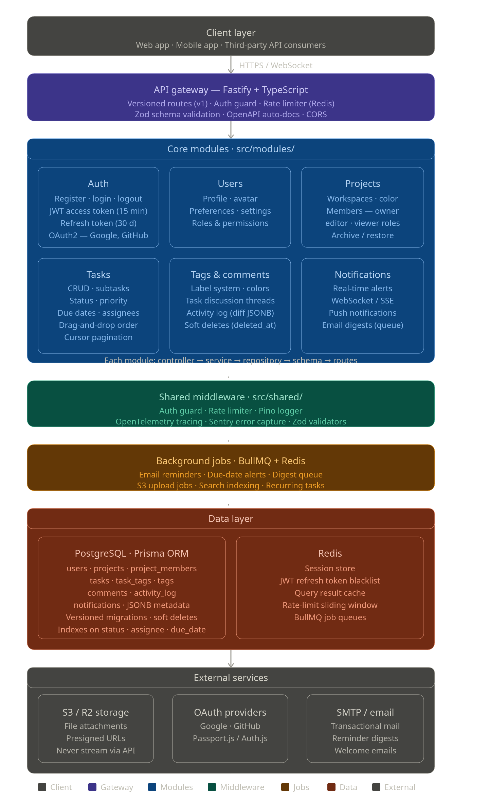

### mtm (My Task Manager)
Maintainable and scalable mobile application and web app task manager project for professional documentation and leveraging productivity accomplishments.

### Project Structure
Comprehensive initial Project structure for reference and future improvements.

- **Layered Backend Architecture**


- **Backend Folder Structure**
This is the initial backend folder structure

```
mtm-backend/
├── src/
│   ├── config/           # env, db, redis config
│   ├── modules/
│   │   ├── auth/         # login, register, OAuth, tokens
│   │   ├── users/        # profile, preferences, settings
│   │   ├── tasks/        # CRUD, filtering, sorting
│   │   ├── projects/     # workspace/project grouping
│   │   ├── tags/         # label system
│   │   ├── comments/     # task discussions
│   │   └── notifications/# real-time alerts
│   ├── shared/
│   │   ├── middleware/   # auth guard, rate limiter, logger
│   │   ├── utils/        # helpers, validators
│   │   └── types/        # shared TypeScript types
│   ├── jobs/             # background jobs (reminders, digests)
│   └── app.ts            # Fastify app bootstrap
├── prisma/
│   ├── schema.prisma
│   └── migrations/
├── tests/
│   ├── unit/
│   └── integration/
└── docker-compose.yml
```
- **API design**
RESTful APIs

```
POST   /api/v1/auth/register
POST   /api/v1/auth/login
POST   /api/v1/auth/refresh
DELETE /api/v1/auth/logout

GET    /api/v1/projects
POST   /api/v1/projects
PATCH  /api/v1/projects/:id
DELETE /api/v1/projects/:id

GET    /api/v1/projects/:projectId/tasks
POST   /api/v1/projects/:projectId/tasks
GET    /api/v1/tasks/:id
PATCH  /api/v1/tasks/:id
DELETE /api/v1/tasks/:id
POST   /api/v1/tasks/:id/comments
PATCH  /api/v1/tasks/reorder       # for drag-and-drop
```
- **DB Schema**
Core Tables

```
users          → id, email, password_hash, display_name, created_at
workspaces     → id, name, owner_id, created_at
projects       → id, workspace_id, name, color, archived
tasks          → id, project_id, assignee_id, title, description,
                 status, priority, due_date, position, parent_task_id
labels         → id, workspace_id, name, color
task_labels    → task_id, label_id
activity_log   → id, task_id, user_id, action, payload, created_at
```

### Tech Stack
Initial best stack for maintainability and scalability
- **Runtime & Framework
- Node.js + TypeScript
- Fastify
- Prisma ORM
- **Database**
- PostgreSQL
- Redis
- **Auth**
- JWT + Refresh Tokens
- OAuth2

### Installations
- **mtm-backend**
npm init -y (package.json)
- **Core dependencies**
npm install fastify @fastify/cors @fastify/cookie @fastify/websocket @fastify/rate-limit
npm install @prisma/client
npm install zod
npm install jsonwebtoken
npm install ioredis
npm install bullmq
npm install pino pino-pretty
npm install passport passport-google-oauth20 passport-github2
npm install bcryptjs
npm install uuid
- **DevDependencies**
npm install -D typescript ts-node tsx
npm install -D @types/node @types/jsonwebtoken @types/passport @types/bcryptjs @types/uuid
npm install -D prisma
npm install -D vitest supertest @types/supertest
npm install -D eslint prettier