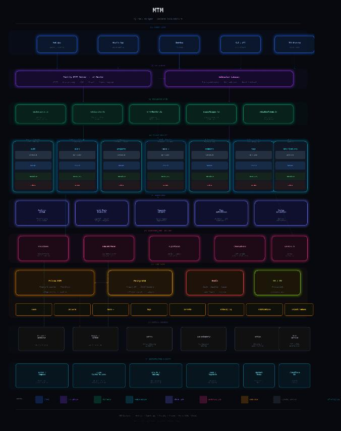

### mtm (My Task Manager)
Maintainable and scalable application and web app task manager project for professional documentation and leveraging productivity accomplishments.

### Project Structure
Comprehensive initial Project structure for reference and future improvements.

- **Layered Backend Architecture**


- **Backend Folder Structure**
This is the initial backend folder structure

```
mtm-backend/
├── src/
│   ├── config/           # env, db, redis config
│   ├── modules/
│   │   ├── auth/         # login, register, OAuth, tokens
│   │   ├── users/        # profile, preferences, settings
│   │   ├── tasks/        # CRUD, filtering, sorting
│   │   ├── projects/     # workspace/project grouping
│   │   ├── tags/         # label system
│   │   ├── comments/     # task discussions
│   │   └── notifications/# real-time alerts
│   ├── shared/
│   │   ├── middleware/   # auth guard, rate limiter, logger
│   │   ├── utils/        # helpers, validators
│   │   └── types/        # shared TypeScript types
│   ├── jobs/             # background jobs (reminders, digests)
│   └── app.ts            # Fastify app bootstrap
├── prisma/
│   ├── schema.prisma
│   └── migrations/
├── tests/
│   ├── unit/
│   └── integration/
└── docker-compose.yml
```
- **API design**
RESTful APIs

```
POST /auth/register, POST /auth/login, POST /auth/refresh — authentication
GET/POST /tasks, PATCH /tasks/:id, DELETE /tasks/:id — task CRUD
GET/POST /projects, GET /projects/:id/tasks — project and board management
GET /users/me, PATCH /users/me/preferences — user profile
GET /notifications + WebSocket at /ws — real-time updates
```
- **DB Schema**
Core Tables

```
users          → id, email, password_hash, display_name, created_at
workspaces     → id, name, owner_id, created_at
projects       → id, workspace_id, name, color, archived
tasks          → id, project_id, assignee_id, title, description,
                 status, priority, due_date, position, parent_task_id
labels         → id, workspace_id, name, color
task_labels    → task_id, label_id
activity_log   → id, task_id, user_id, action, payload, created_at
```

### Tech Stack
Initial best stack for maintainability and scalability
- **Runtime & Framework
- Node.js + TypeScript
- Fastify
- Prisma ORM
- **Database**
- PostgreSQL
- Redis
- **Auth**
- JWT + Refresh Tokens
- OAuth2


### Features
***Layer 1***
- ***Auth***
Sign up / login / logout
OAuth
Invite teammates via email
- ***Workspaces***
Create / switch workspaces
Member roles (Owner, Admin, Member, Guest)

- ***Projects***
Create / achive projects
Project color and icon

- ***Tasks***
Create, edit, delete tasks
Title, description
Status, priority, dues date
Assignee
SUbtaska
Tags / labels
Drag-and-Drop reordering

- ***Views***
Kanban board
List view
Search across all tasks

***Layer 2***
Comments on tasks
File attachments
Activity feed
Notifications
Keyboard shortcuts
Dark mode
Due date reminders
Filter & sort tasks

***Layer 3***
Calendar view
Time tracking
Dashboard / analytics
Push notifications (mobile)
Offline mode (mobile + desktop)
Export to CSV / PDF
Mentions (@user in comments)